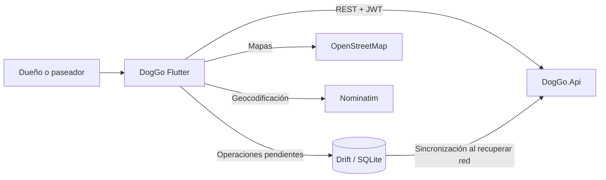

# DogGo Flutter

Aplicación móvil de DogGo para dueños de perros y paseadores. Consume `DogGo.Api`, permite cambiar de modo dentro de una misma cuenta y mantiene operaciones críticas del paseo cuando la conectividad es inestable.

Repositorio: [javiite/DogGo_Flutter](https://github.com/javiite/DogGo_Flutter)

## Lugar dentro del sistema

Flutter es uno de los clientes de la plataforma; no contiene la autoridad final del negocio ni se conecta directamente a MySQL. Las reglas de permisos, precios, estados y participantes se vuelven a validar en el backend.



## Funcionalidades actuales

### Cuenta y perfiles

- Registro, confirmación de correo e inicio de sesión.
- Recuperación y cambio de contraseña.
- Configuración de la dirección de la API.
- Perfil general, fotografía y datos de contacto.
- Perfil de dueño y perfil profesional de paseador.
- Cambio entre los modos Dueño y Paseador.
- Solicitud de verificación del paseador.

### Dueños y mascotas

- Alta, edición y consulta de perros.
- Fotografía principal, galería y perfil de comportamiento.
- Búsqueda y detalle de paseadores.
- Selección de mascotas, fecha, hora, ubicación y ruta para solicitar un paseo.
- Paseos simples, múltiples y programados.

### Operación del paseo

- Agenda y solicitudes del paseador.
- Aceptar, rechazar, cancelar, iniciar y finalizar conforme al estado permitido.
- Evidencia fotográfica de inicio y fin.
- Ubicación durante el paseo y visualización de la ruta.
- Rutas guardadas y planeación sobre mapas.
- Chat, notificaciones y calificaciones.
- Disponibilidad semanal y bloqueos de horario del paseador.

### Trabajo sin conexión

La aplicación utiliza Drift sobre SQLite para conservar:

- Puntos GPS pendientes de sincronización.
- Operaciones de paseo que todavía no llegaron al servidor.
- Paseos guardados para consulta local.

Al recuperar conectividad, el servicio offline intenta enviar el trabajo pendiente. Los puntos y operaciones incluyen identificadores del cliente para que el backend pueda procesarlos de forma idempotente y evitar duplicados. La base local es un apoyo temporal; MySQL a través de `DogGo.Api` sigue siendo la fuente de verdad.

## Tecnologías y paquetes principales

- Flutter y Dart 3.11.
- `http` para la API REST.
- `shared_preferences` para configuración y sesión local actual.
- `drift` y `drift_flutter` para persistencia offline.
- `connectivity_plus` para detectar cambios de red.
- `geolocator` y `flutter_background_service` para ubicación durante paseos.
- `flutter_map`, `latlong2` y OpenStreetMap para mapas.
- `image_picker` para perfiles, mascotas y evidencias.
- `permission_handler` para permisos del dispositivo.
- `flutter_local_notifications` para notificaciones locales.

## Organización del código

```text
lib/
├── app.dart / main.dart       Arranque y composición principal
├── core/
│   ├── database/              Base Drift y tablas locales
│   ├── errors/                Errores normalizados de API
│   ├── navigation/            Rutas de navegación
│   ├── offline/               Cola, caché y sincronización
│   ├── permissions/           Modelo de permisos
│   └── session/               Estado global de sesión
├── screens/                   Pantallas, controllers, state y modelos por función
├── services/                  API, auth, paseos, tracking, chat y almacenamiento
├── shared/widgets/            Estados de carga, error, vacío y sincronización
├── theme/                     Colores, espaciado y estilos
└── widgets/                   Componentes visuales reutilizables
```

La interfaz nueva agrupa cada función con modelos, estado y controller. Algunos servicios siguen siendo compartidos para mantener en un solo lugar los endpoints, la sesión y el manejo de errores.

## Requisitos

- Flutter SDK compatible con Dart `^3.11.5`.
- Android Studio o Xcode según la plataforma.
- Un emulador o dispositivo físico.
- `DogGo.Api` activa.
- ADB para el flujo recomendado con Android físico y API local.

Comprobar el entorno:

```powershell
flutter doctor
```

## Instalación

```powershell
flutter pub get
```

El archivo generado de Drift está versionado. Si se cambian las tablas o anotaciones de la base local, se debe regenerar:

```powershell
dart run build_runner build --delete-conflicting-outputs
```

## Conectar con la API local

La dirección predeterminada es:

```text
http://127.0.0.1:5230
```

### Android físico por USB

Con `DogGo.Api` activa en el equipo:

```powershell
adb reverse tcp:5230 tcp:5230
flutter run
```

Así, `127.0.0.1:5230` en el teléfono se redirige al puerto `5230` de la computadora.

### Emulador Android

Según la red del emulador puede ser necesario configurar:

```text
http://10.0.2.2:5230
```

### Dispositivo en la misma red

También se puede usar la IP LAN del equipo, por ejemplo `http://192.168.x.x:5230`. La API debe escuchar en una interfaz accesible y el firewall debe permitir el puerto. La dirección se puede modificar desde la configuración de la aplicación.

En producción siempre debe utilizarse una URL HTTPS real.

## Ejecución y validación

```powershell
flutter analyze
flutter test
flutter run
```

Para comprobar una compilación Android:

```powershell
flutter build apk --debug
```

Las pruebas automáticas no sustituyen el recorrido con un dispositivo real, especialmente para cámara, galería, permisos, ubicación en segundo plano, pérdida de red y recuperación de operaciones pendientes.

## Permisos móviles

Android declara acceso a Internet, estado de red, cámara, imágenes, notificaciones, ubicación precisa/aproximada, ubicación en segundo plano, servicio en primer plano y `WAKE_LOCK`.

iOS incluye descripciones para cámara, biblioteca de fotos, red local y ubicación durante el uso y en segundo plano. También habilita los modos de ubicación y recuperación en background.

La aplicación debe solicitar cada permiso únicamente cuando la función lo requiera y explicar al usuario por qué es necesario. La ubicación en segundo plano se justifica solo durante un paseo activo.

## Seguridad y privacidad

- La API autentica las solicitudes mediante JWT y vuelve a validar los permisos por recurso.
- En modo debug solo se registran método, ruta y código HTTP; no se debe imprimir el JWT ni información sensible.
- Las fotografías y ubicaciones deben enviarse únicamente a la API configurada.
- Los datos offline deben eliminarse cuando ya no sean necesarios o al cerrar/eliminar la cuenta según la política definitiva.
- La URL de producción debe usar HTTPS y certificados válidos.

Actualmente el JWT se almacena con `shared_preferences`. Esto es suficiente para el entorno local actual, pero antes de una distribución productiva debe migrarse a almacenamiento seguro del sistema, como Android Keystore y iOS Keychain mediante un paquete especializado.

Android permite tráfico HTTP sin cifrar para facilitar el desarrollo local. Esa excepción debe restringirse o eliminarse en la variante de producción.

## Relación con otros repositorios

- [Backend y API](https://github.com/javiite/doggos-backy).
- [Web pública](https://github.com/javiite/doggos_pw).
- [Panel administrativo](https://github.com/javiite/doggos_aw).

## Estado actual

La aplicación ya integra los flujos principales de dueño y paseador, perfiles, mascotas, disponibilidad, paseos, evidencias, mapas, chat, notificaciones, calificaciones y recuperación offline. El README anterior describía una auditoría de mayo de 2026 y afirmaba una certificación que no representaba el estado completo del producto; esta versión documenta el código vigente.

Antes de distribuirla públicamente quedan las pruebas funcionales finales en Android e iOS, protección segura del token, endurecimiento de red para producción, validación de consumo de batería y ubicación en segundo plano, configuración de firma y tiendas, observabilidad y revisión legal de privacidad.
